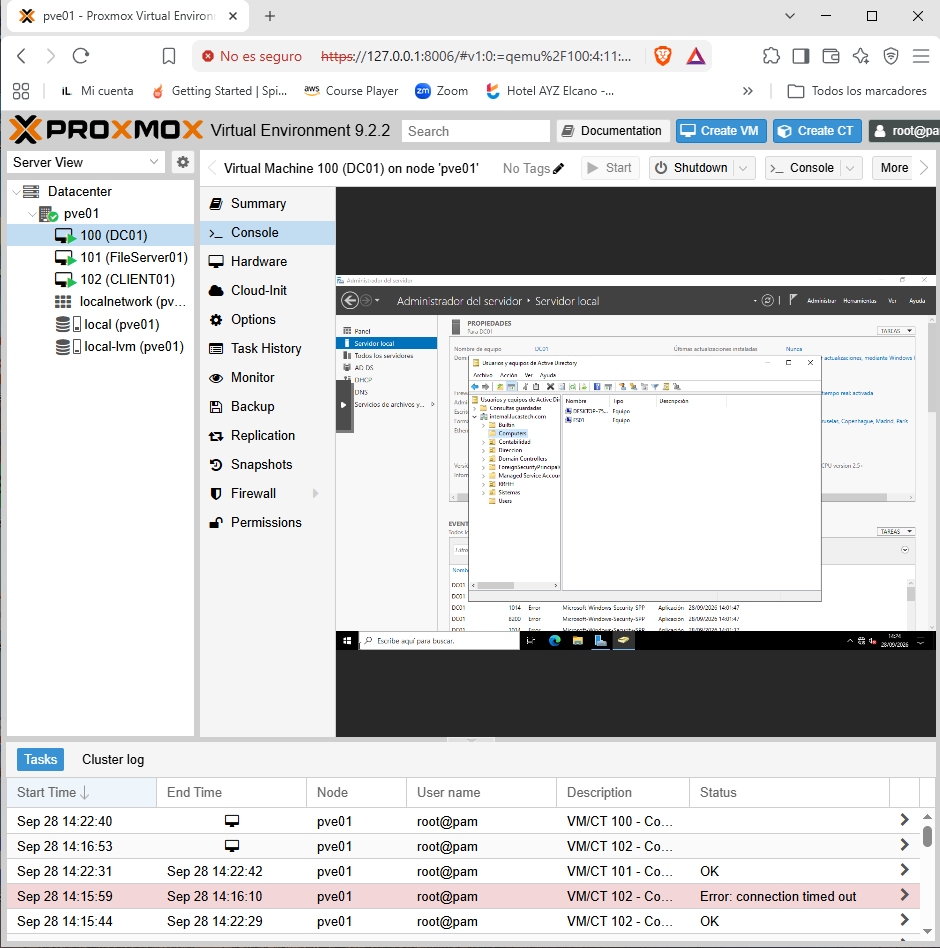
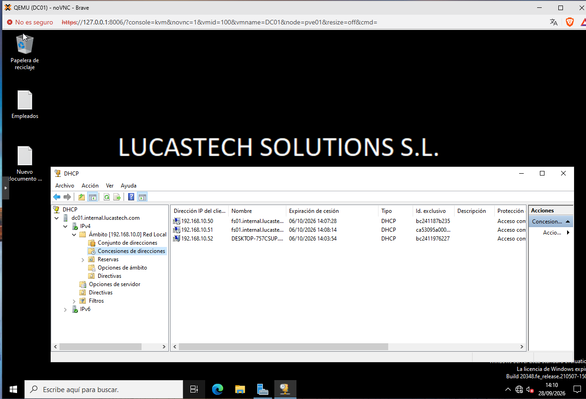
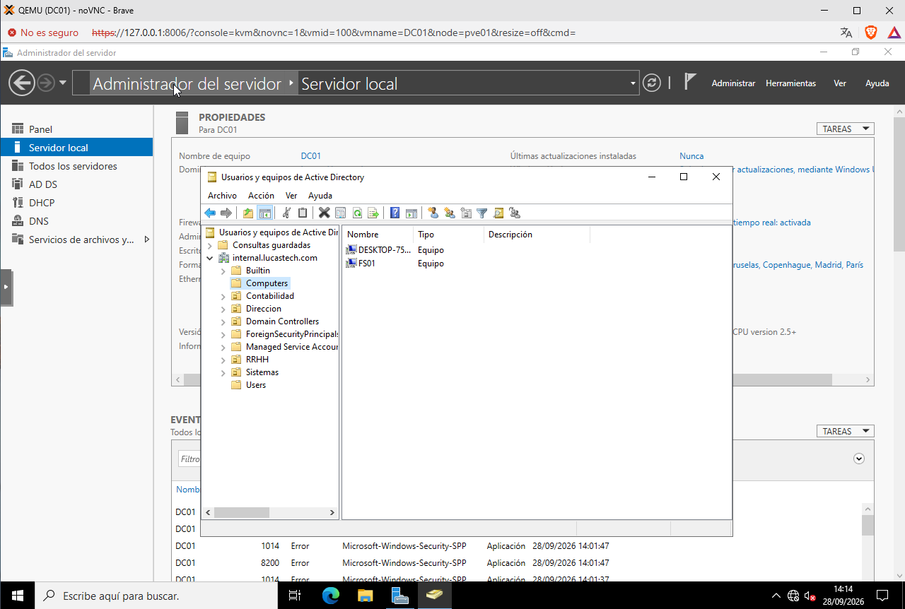
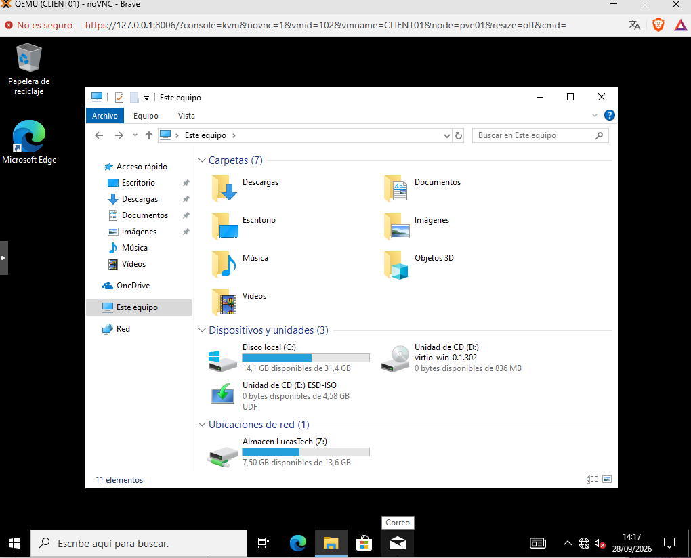
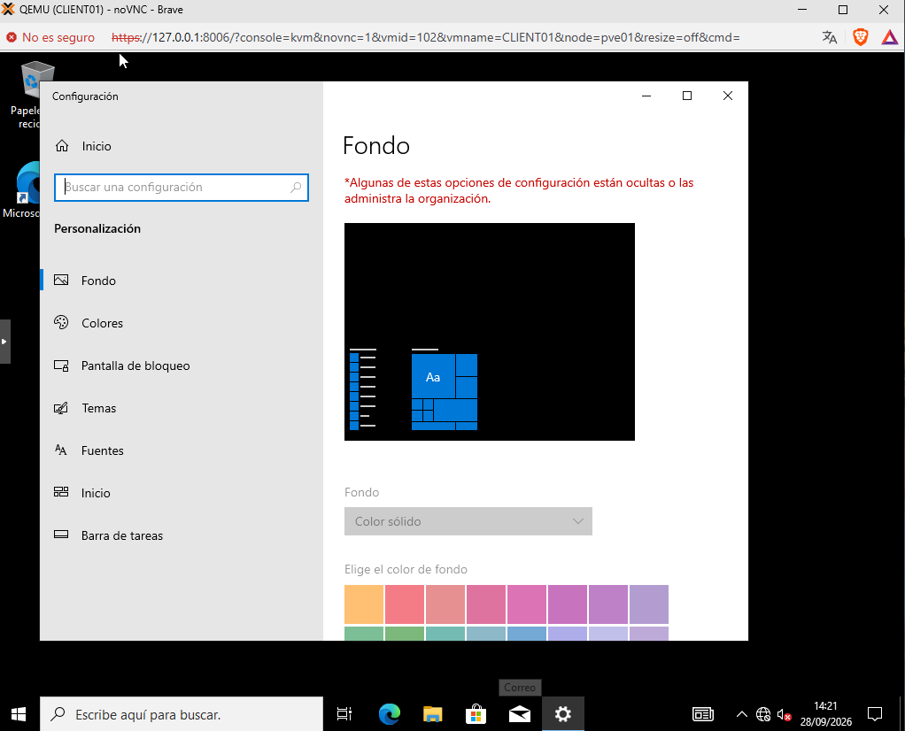

# 🚀 LucasTech Hybrid Infrastructure Solutions

This repository contains the complete technical documentation, enterprise automation scripts, and core configuration files corresponding to the hybrid infrastructure deployment for **LucasTech Solutions S.L.** (under the centralized active directory domain `internal.lucastech.com`).

The entire environment has been successfully designed, deployed, and audited using an enterprise cross-platform model running inside an isolated virtual perimeter.

---

## 🗺️ Network Topology & Environment Architecture

The production infrastructure is strictly bound to an isolated corporate host-only bridge (**`vmbr1`**) deployed on a **Proxmox VE** hypervisor, securing all internal company data traffic from external network vulnerabilities:

*   **`DC01` (Windows Server 2022)**: Primary Domain Controller. Static IP: `192.168.10.10`. Active Roles: Active Directory Domain Services (AD DS), Authoritative DNS Server, and Corporate DHCP Server responsible for automated workstation IP provisioning.
*   **`FS01` (Ubuntu Server 24.04 LTS)**: Enterprise Storage Server. Dynamic IP via central DHCP reservation: `192.168.10.51`. Active Role: Linux Samba File Services integrated natively into the Windows Active Directory domain via Kerberos v5 for single sign-on (SSO).
*   **`CLIENT01` (Windows 10 Pro)**: Standard Corporate Workstation (`ltech`). Dynamic IP via DHCP: `192.168.10.52`. Fully joined to the domain and managed centralizadamente through strict Active Directory Group Policies (GPOs).

---

## 🛠️ Systems Engineering & Implemented Solutions

### 1. Automated AD Provisioning (PowerShell)
Developed an automated mass deployment script (`/scripts/provision-users.ps1`) to initialize the corporate Organizational Units (OUs) corresponding to the company's departments (Systems, Management, Accounting, HR) and securely provision user accounts with default parameters, security strings, and specific roles.

### 2. Cross-Platform Hybrid Interoperability
Configured active Samba storage services on GNU/Linux (`/config/smb.conf`). By enforcing strict time synchronization and negotiating ticket exchanges via Kerberos v5, Windows domain users can seamlessly read and write data directly into the Linux file system with fully integrated ACL auditing.

### 3. Centralized System Hardening & Environment GPOs
*   **Automated Drive Mapping**: Enforces a central policy that automatically mounts the Linux Samba share as **`Drive Z:`** (*Almacen LucasTech*) on user logon.
*   **Corporate Branding Enforcement**: Centralized deployment of the official company desktop background across all workstations via `NETLOGON`, blocking any local customization attempts to ensure workplace environment uniformity.

---

## 📂 Repository Layout
*   📁 **`/docs`**: Infrastructure designs and planning documentation (`infrastructure-design.md`, `company-design.md`, `project-overview.md`).
*   📁 **`/scripts`**: Core automation files (PowerShell Active Directory provisioning).
*   📁 **`/config`**: Linux production service layouts (Samba server configuration).

---

## 📸 Deployed Environment Visual Evidence

### 1. Virtualization & Infrastructure Topology (Proxmox VE Console)

### 2. Centralized Network Control (Active DHCP Scope Address Leases)

### 3. Cross-Platform Systems Integration (Linux FS01 Object inside Active Directory)

### 4. Hybrid Interoperability Validation (Linux Samba Drive Z: Auto-Mounted on Client)

### 5. Centralized Workspace Hardening (Corporate Background Locked by GPO)

